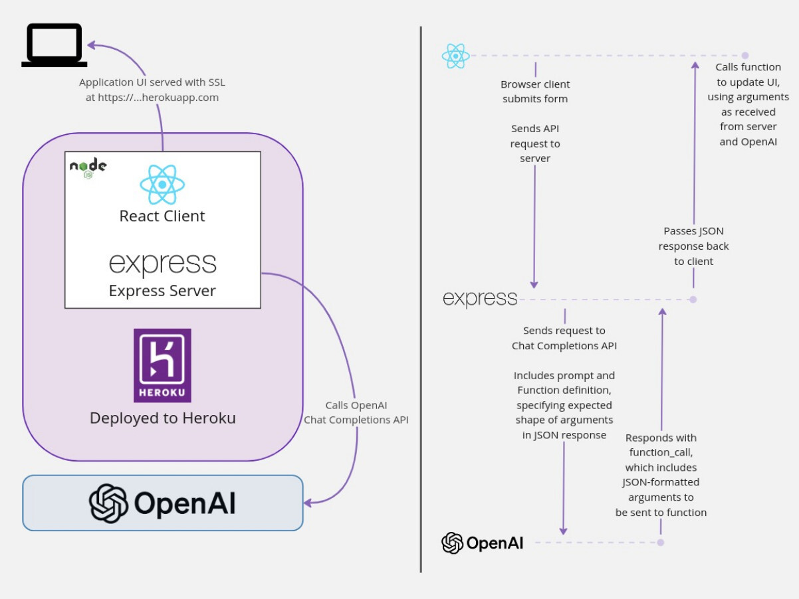

# Menu Maker

[](https://heroku.com/deploy?template=https://github.com/heroku-reference-apps/menumaker)

A web application that generates recipes based on ingredients you have on hand!


## Implementation details

This is a Node.js Express API server that also serves a React frontned.

The frontend can be found at `/index.html` (or simply `/`).

The backend API has a single endpoint. `POST /ingredients` takes a list of ingredients (as a single string) and then sends a request to OpenAI's chat completion API to generate content around a restaurant dish that can be made with those ingredients.

The implementation uses OpenAI ChatGPT functions, which allows us to specify the JSON structure of the data to be returned, which can more easily be passed as arguments directly to a function in our code (or, in this case, to be passed back to the frontend, which will use the arguments for a function call there).



To use this application, you will need an [OpenAI API Key](https://platform.openai.com/) to make calls to the chat completion API.

> [!NOTE]
> Every OpenAI request incurs costs, the price may vary depending on the selected model, for example, using the GPT-3 model, in order to reach $1 you'll need to request more than 30,000 times. Please refer to the [OpenAI API pricing](https://openai.com/pricing) page for more information.

## Local setup

This project is set to use Node `v20.10.0`. Install and use this version with [`volta`](https://volta.sh).

1. Install dependencies

```bash
yarn install
```

1. Make local copy of `.env` and customize

```bash
cp .env.template .env
```

1. Edit `.env` to add environment variables

Add `OPENAI_API_KEY` (which you will need to obstain from your OpenAI account).

If you want to use a port other than the default (`3000`), add `PORT` environment variable.

If you want to use a different [ChatGPT model](https://platform.openai.com/docs/models/overview) than the default (`gpt-3.5-turbo-1106`), add `CHATGPT_MODEL` environment variable.

## Local running

Start API server on (default) port 3000

```bash
yarn build && yarn start
```

## Local tests

```bash
yarn test
```

## Heroku deploy

Create an Heroku application:

```bash
heroku create <app-name>
```

Be sure to add `OPENAI_API_KEY` environment variable:

```bash
heroku config:set OPENAI_API_KEY=sk-vxxxxxxx
```

Add the code to your local git repository and deploy to Heroku with:

```bash
git push heroku main
```
